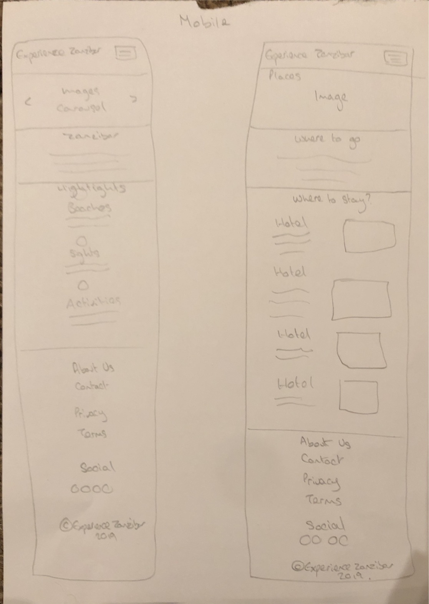

# Experience Zanzibar

This is the repository for the Experience Zanzibar website.

The Deployed Version of the site can be visited by clicking <a target="_blank" href="https://carly07.github.io/milestone-project-1-experience-zanzibar/activities.html">here.</a>

The site provides a digital guide to Zanzibar designed by me, Carly Clark, to inspire and assist fellow travellers to plan their own Zanzibar experience.  

The site’s landing page offers users a taste of Zanzibar with an eye-catching carousel of images, a brief overview and some of the island’s highlights. From there users can easily navigate the site using the menu bar / collapsed button to learn more about where they should stay, what’s worth seeing, what activities they can do and what they need to know. There is also a contact form offering users the chance to ask questions and seek more tailored advice and information.   

## UX

My goal was to design a site that provides relevant information, in an easily accessible format, that inspires and assists others to travel to Zanzibar. I opted for a grey and white colour scheme interspersed with bright colourful pictures for a modern enticing feel. This was coupled with a simple, minimalist structure, which, far from overwhelming users, allows them to interact with the site and choose what information they would like to read when they want to read it. This format is repeated throughout the site offering comfort and familiarity. I have also provided a link from all pages within the site to a contact form enabling easy access for users to ask a question if they wish. 

### User Stories

As a traveller / holidaymaker still undecided about my destination, I would like an overview of what Zanzibar has to offer that entices and inspires me. 

As a traveller / holidaymaker already set on Zanzibar as my destination, I want to access to informative content, in a logical format that will assist me in planning my trip. I would also like to be able to ask questions and seek more tailored advice quickly and easily.

As a member of the tourism industry, I want a platform where I can promote my business / services. I would like to be able to get in touch about advertising my business on the site. 

### Wireframes

## Features

The basic layout of the website was created using the <a target="_blank" href="https://getbootstrap.com/">Bootstrap 4</a> grid system. There are five main pages on the site, each with various features created with bootstrap components and modified using CSS. 

### Existing Features

#### Navbar

The navbar was created using Bootstrap. It is fixed to the top of each page on the site and collapses behind a button to the right on smaller devices for a minimalist feel. On the left, the nav-brand, Experience Zanzibar, has been added to an anchor element which provides a link to the home page. The nav-brand is followed by nav-links to the other main pages on the site. On the far right of the navbar is a bootstrap button inviting users to ask a question. On smaller devices when the navbar is collapsed, the Ask a Question button is hidden and replaced with an Ask a Question nav-link at the bottom of the menu. 

#### Footer

The footer was created using the same colour scheme as the navbar for comfort and familiarity. There are three headings; the first, Experience Zanzibar, contains a link to an ‘About Us’ page and another link to the ‘Contact Us’ form. Under the second heading, Our Policies, users can find links to the sites ‘Terms of Use’ and ‘Privacy Policy’, whilst the last heading, Follow Us, invites users to follow links to five social media platforms. These are currently linked to the relevant social media home pages as Experience Zanzibar does not have a presence on Social Media. At the bottom of the footer, in smaller text is some copyright text. On larger devices this content is split across three columns whilst on smaller devices the content is displayed in one column for user experience. 

#### Ask a Question / Contact us

Users can ask a question and seek advice either by clicking the Ask a Question button / link in the navbar or the Contact Us link in the footer. These two links are available on all pages within the site for ease of use. There’s also an Ask a Question button available at the bottom of the overview section on the Planning page. Clicking on theses buttons / links will open a bootstrap modal containing a simple bootstrap form. Users are only required to provide a few basic details (name, email and country) before using the free text box to type their question or query and clicking the submit button. 

#### Overview Sections

Each page has an overview section containing a few paragraphs introducing the topic of the page. The first paragraph of each has slightly larger font to catch users’ attention and entice them to read on. 

#### Topic Section

On each page, under the overview section, users can access further information regarding the page topic. Bootstrap cards have been utilised within these sections to display media content and some brief text with the added option to click on the button or link provided to read more about each item. On the home page, the Read More buttons take the user to the relevant page on the site whilst the Read More links provided on the Places, Sights, Activities and Planning pages, trigger bootstrap modals offering the user more text information regarding the item concerned.

On small devices the cards are displayed on top of each other in a single column whilst on larger devices the cards are generally made horizontal and are displayed across a number of columns and rows. Photos contained in the Highlights cards on the home page are hidden on smaller devices and replaced with font awesome icons to promote a mobile friendly design. 

#### Media

Numerous images, videos and audio clips have been used across the site to stimulate the user’s senses, enabling them to visualise their Zanzibar trip and emerge themselves in the local culture. The images have been added using bootstrap carousels, jumbotrons and cards whilst the video and audio clips have been added using bootstraps embed utility. 

### Features Left to Implement

In the future I would like to add JavaScript to the contact form to enable information to be transmitted via a server.

I would also like to add a booking system so users can book tours, activities and hotels. 

## Technologies Used

All the languages, frameworks, libraries, and tools used to construct this project are listed below. I have also provided a link to each official site and a brief overview of its usage.

•	<a target="_blank" href="https://us-east-1.console.aws.amazon.com/cloud9/home?region=us-east-1#">AWS Cloud9</a> – This project was built using a cloud9 Integrated Development Environment

•	HTML – the content of the website was written using HTML5

•	CSS – the website’s customised style was created using CSS3

•	<a target="_blank" href="https://getbootstrap.com/">Bootstrap v4.3.1</a> - The site was built using Bootstrap's grid system. I also adopted and modified several Bootstrap components.

•	JavaScript - The project uses the following <a target="_blank" href="https://getbootstrap.com/docs/4.3/getting-started/introduction/">JavaScript plugins</a> to ensure functionality of the bootstrap components used; jQuery, Popper.js and Bootstrap's own min.js.6

•	<a target="_blank" href="https://fontawesome.com/">Font Awesome</a> - The icons used within this website were sourced from Font Awesome. 

•	<a target="_blank" href="https://fonts.google.com/">Google Fonts</a> – the font used throughout this website was obtained from Google Fonts.

•	<a target="_blank" href="https://github.com/">GitHub</a> – GitHub was used for version control

•	<a target="_blank" href="https://validator.w3.org/">W3C Markup Validation Service</a> - The HTML and CSS code for this project was checked and validated by the W3C Markup Validation Service

## Testing

### Developer tools

AWS cloud9 live preview, google chrome developer tools and responsinator were utilised throughout the development of the project to identify and successfully address any bugs, errors or style issues affecting UX on various screen resolutions. 

### User scenarios

The traveller and holiday maker still undecided on their destination achieved their desired outcome of being presented with an overview of what Zanzibar has to offer that entices and inspires them. They arrive at the sites landing page and are immediately greeted to a carousel of three bright enticing images typical of Zanzibar. They can then read a brief overview about Zanzibar and look at its highlights. If they choose to, they can easily read on by clicking the Read More buttons which take the user to the relevant page (places, sights or activities) within the site. These buttons were tested on various devices to ensure functionality. 

Those traveller and holidaymakers already set on Zanzibar as their destination, achieved their goal of accessing informative content in a logical format that will assist them in planning. Information regarding Zanzibar has been organised into five pages; on the landing page users can read an overview about Zanzibar and from there they can choose to read more about place, sights, activities and planning. On each page users are presented with the same format; an image and some text introducing the topic followed by a section containing cards which showcase Zanzibar’s hotels, sights, activities or provide users with further information to assist in when planning their trip. 

If users click on the links within the hotels (on smaller devices), sights, activities and planning cards, a modal will open containing further information regarding that item. Users can scroll through the information and once finished click on the close button at the bottom or the cross at the top right which closes the form. Users can also view video clips of four different hotels or listen to some local songs by clicking the relevant play buttons found on the hotel cards or in the Local Music section. All the links and buttons contained within the site were tested on various devices to ensure functionality. If users require additional information or advice not contained within the site, they can easily get in touch by clicking the Ask a Question button / link in the navbar. Clicking on this will open a modal containing a short contact form. 

Members of the tourism industry can achieve their intended outcome of having a platform where they can promote their business / services (hotels, activities, tours) by getting in touch using the Contact Us link in the footer. This link opens the same contact form mentioned above. 

On the Contact Us form all users are required to enter their name, email, country and question before pressing the submit button. If users change their mind, they can click on the cross at the top right of the form to close the form. If users try to submit the form with any of the fields blank, they are presented with a message requesting they enter the required details. Similarly, if they enter an invalid email address they receive an error message. Once the form is complete, users can click on the submit button which closes the form and reloads the page. 

### Multiple browsers and devices

After the site was deployed, I tested it across four browsers (Chrome, Safari, Internet Explorer, FireFox) and on multiple devices (Samsung Galaxy J3, iPhone 7 Plus, 8, iPad 6, iPad Air, MacBook Air, HP laptop and iMac) to ensure compatibility and responsiveness. 

Whilst testing, I noticed that the background photos appeared zoomed-in both on Chrome and Safari in iOS. On further exploration I discovered that background-attachment: fixed is not compatible with iOS browsers. The issue was fixed by adding a media query with the property value background-attachment: scroll. 

Similarly, I realised that whilst the Ask a Question buttons were working fine on iOS, the Ask a Question / Contact Us links were not triggering the modal as they did on other operating systems. Having researched the problem, I found that adding href=“#” to the anchor element resolved the issue. 

Testing also revealed a separate issue with the contact form where the ‘required’ attribute for the Country select box was not having the desired effect. Users were able to submit the form without selecting their own country because ‘Country’ was the < option > selected rather than just a placeholder. This issue was fixed by adding disabled, hidden and empty value attributes to < option selected>Country< / option >. The disabled and hidden attributes stop ‘Country’ from being selected by users and hides it from the dropdown list whilst using an empty value attribute allows the required attribute to work, so if the option isn't changed from ‘Country’ the browser now prompt the user to choose an option from the list.

## Deployment

This website is hosted by <a target="_blank" href="https://pages.github.com/">GitHub Pages</a> 

It was deployed by selecting <strong>master branch</strong> from the <strong>Source</strong> dropdown menu contained within the GitHub Pages section of the <strong>Settings</strong> tab on my GitHub projects’ repository.

To run the project locally, simply clone the repository directly into your chosen editor by typing ‘git clone’ and then pasting https://carly07.github.io/milestone-project-1-experience-zanzibar/ into your terminal. 

## Credits

### Content

#### index.html

•	The text for <strong>Zanzibar</strong> section was copied and adapted from <a target="_blank" href="https://www.lonelyplanet.com/tanzania/zanzibar-archipelago">Lonely Planet</a>, <a target="_blank" href="https://www.tanzaniaodyssey.com/tanzania/zanzibar">Tanzania Odyssey</a> and <a target="_blank" href="http://zanzibar.net/what-is-zanzibar/">Zanzibar.net</a>

•	The <strong>Beautiful Beaches</strong> text was copied and adapted from <a target="_blank" href="http://zanzibar.net/paradise-beaches/">Zanzibar.net</a>

•	The <strong>Stunning Sights</strong> text was taken from <a target="_blank" href="https://www.shadowsofafrica.com/sl/destinacije/zanzibar/attractions">Shadows of Africa</a>

•	The <strong>Awesome Activities</strong> text was written by me. 

#### places.html

•	The text for the <strong>Where to go</strong> section was copied and adapted from <a target="_blank" href="http://zanzibar.net/paradise-beaches/">Zanzibar.net</a> and <a target="_blank" href="https://www.africanaturephotography.com/zanzibar/">Africa Nature Photography</a>

•	The <strong>Nungwi Dreams</strong> text was taken from <a target="_blank" href="https://www.nungwidreams.com/destination">Nungwi Dreams</a>

•	The <strong>Park Hyatt</strong> text was taken from <a target="_blank" href="https://www.hyatt.com/en-US/hotel/tanzania/park-hyatt-zanzibar/znzph">Park Hyatt</a>

•	The <strong>Blue Moon</strong> text was taken from <a target="_blank" href="https://www.blue-moonresort.com/">Blue Moon Resort</a>

•	The <strong>Fruit and Spice Wellness Resort</strong> text was taken from <a target="_blank" href="https://fruitandspiceresort.travel/">Fruit and Spice Wellness Resort</a>

#### sights.html

•	The text for the <strong>What to see</strong> section was copied and adapted from <a target="_blank" href="https://www.tanzaniatourism.go.tz/en/destination/zanzibar-island/P20">Tanzania Tourism</a>, <a target="_blank" href="https://www.intrepidtravel.com/adventures/zanzibar-beaches-island-guide/">Intrepid Travel</a> and <a target="_blank" href="https://www.lonelyplanet.com/africa/planning/highlights/5c9a4d5d-d208-49ad-8ca0-cc64f86bd297/a/nar/5c9a4d5d-d208-49ad-8ca0-cc64f86bd297/355064">Lonely Planet</a>

•	All the text on the modals within the <strong>Sights of Stone Town</strong> section were copied from <a target="_blank" href="https://www.lonelyplanet.com/tanzania/zanzibar-archipelago/zanzibar-unguja">Lonely Planet</a>

#### activities.html

•	The text for the <strong>What to do</strong> section was copied and adapted from <a target="_blank" href="https://www.expedia.com/Things-To-Do-In-Zanzibar.d4186.Travel-Guide-Activities">Expedia</a>

•	The <strong>Scuba Diving</strong> text was copied and adapted from <a target="_blank" href="https://www.globosurfer.com/diving-in-zanzibar/">Globosurfer</a> and <a target="_blank" href="http://bigoceandivers.com/travel/the-best-time-for-diving-and-snorkeling-in-zanzibar/">Big Ocean Divers</a>

•	The <strong>Snorkelling</strong> text was copied from <a target="_blank" href="https://www.expedia.com/things-to-do/snorkeling-in-mnemba-atoll-in-zanzibar.a503039.activity-details">Expedia</a>

•	The <strong>Kite surfing</strong> text was copied and adapted from <a target="_blank" href="https://www.kitecentrezanzibar.com/">Kite Centre Zanzibar</a>

•	The <strong>Dhow sailing</strong> text was copied and adapted from <a target="_blank" href="http://www.zanzibaryachtcharter.com/zanzibar-traditional-dhow-sailing/">Zanzibar Yart Charter</a>

•	The <strong>Spice tour</strong> text was taken from <a target="_blank" href="https://www.lonelyplanet.com/tanzania/activities/spice-tour-of-zanzibar/a/pa-act/v-10067P16/355640">Lonely Planet</a>

•	The <strong>Jozani Forest tour</strong> text was copied from <a target="_blank" href="https://www.expedia.com/things-to-do/half-day-tour-of-jozani-forest.a473989.activity-details">Expedia</a>

•	The <strong>Prison Island tour</strong> text was copied from <a target="_blank" href="https://www.expedia.com/things-to-do/half-day-tour-of-prison-island.a473986.activity-details">Expedia</a>

•	The <strong>Dolphin tour</strong> text taken taken from <a target="_blank" href="https://www.expedia.com/things-to-do/dolphins-jozani-forest-in-zanzibar.a503012.activity-details">Expedia</a>

#### planner.html

•	The text in the <strong>Planning your Trip</strong> section was written by me. 

•	The text on the <strong>Local history, Etiquette, Security Risks, Health and Getting there</strong> modals was copied from <a target="_blank" href="https://www.lonelyplanet.com/tanzania/zanzibar-archipelago/background/history/a/nar/1f0bc3cc-26ba-4eae-9189-7f8af146be71/355666">lonelyplanet</a>

•	The text on the <strong>Best Time</strong> modal was copied from <a target="_blank" href="https://www.safantatours.co.tz/Best-Time-to-Visit-Zanzibar-Island.php">Safanta Tours</a>

•	The text on the <strong>Entry requirements</strong> mnodal was taken from <a target="_blank" href="https://www.gov.uk/foreign-travel-advice/tanzania/entry-requirements">gov.uk Foreign Travel Advice</a>

•	The text on the <strong>Getting Around</strong> modal was taken from <a target="_blank" href="https://www.urbanadventures.com/blog/the-complete-guide-to-zanzibar-travel.html">Urban Adventures</a>

•	The text on the <strong>Currency</strong> modal was copied from <a target="_blank" href="https://www.gov.uk/foreign-travel-advice/tanzania/money">gov.uk Foreign Travel Advice</a>

•	The <strong>Local Music</strong> text is copied from <a target="_blank" href="https://en.wikipedia.org/wiki/Music_of_Tanzania">Wikipedia</a>

### Media

•	The photographs used throughout this site were found on <a target="_blank" href="https://www.google.com/imghp?hl=en">Google Images</a>

•	The videos contained within this site were sourced from <a target="_blank" href="https://www.youtube.com/">YouTube</a>

•	The audio clips were obtained from <a target="_blank" href="https://www.spotify.com/uk/">Spotify</a>

## Acknowledgements

I received inspiration for this project from the many travel sites that I have visited whilst researching and planning my travel adventures. I would also like to extend a special thanks to my mentor, Antonio, for his help and guidance.